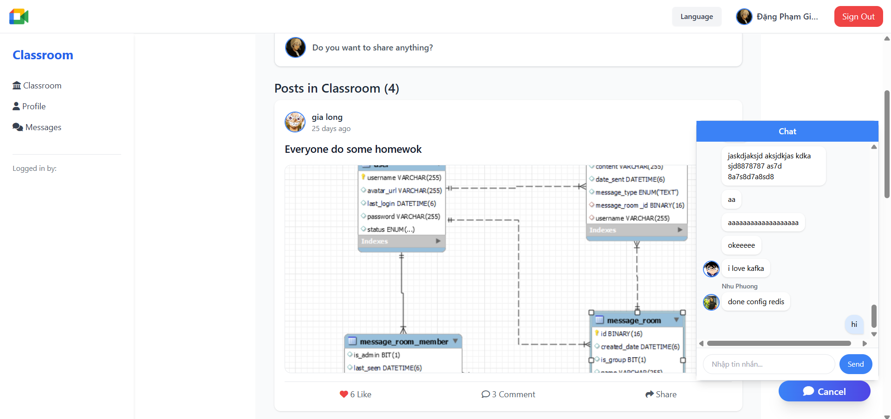
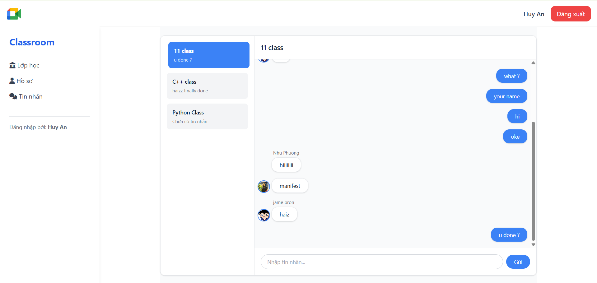

# 📚 Classroom Management System

> Hệ thống quản lý lớp học hiện đại với tính năng chat thời gian thực, chia sẻ bài viết và quản lý bài tập.

## Tổng quan

Classroom Management System là một ứng dụng web full-stack được xây dựng để hỗ trợ việc quản lý lớp học trực tuyến. Hệ thống cho phép giáo viên tạo và quản lý lớp học, học sinh tham gia lớp học, chia sẻ bài viết, chat thời gian thực và quản lý bài tập.

### Tính năng chính

- **Quản lý lớp học**: Tạo lớp, tham gia lớp bằng mã, rời lớp, xóa lớp
- **Chat thời gian thực**: WebSocket chat trong từng lớp học
- **Bài viết**: Tương tác (like, comment)
- **Bài tập**: Tạo và nộp bài tập, chấm điểm
- **Quản lý thành viên**: Xem danh sách thành viên trong lớp
- **Khám phá**: Tìm kiếm và tham gia các lớp học khác

## Giao diện chính

### Giao diện quản lý lớp học

### Tính năng chat thời gian thực  

## Kiến trúc hệ thống

### Backend (Spring Boot)
- **Framework**: Spring Boot 3.3.1
- **Database**: MySQL, Redis
- **Security**: Spring Security + JWT
- **WebSocket**: STOMP Protocol
- **API**: RESTful API

### Frontend (Angular)
- **Framework**: Angular 17
- **UI**: TailwindCSS
- **WebSocket**: SockJS + STOMP

---
⭐ **Nếu dự án này hữu ích, hãy cho một star nhé!** ⭐

